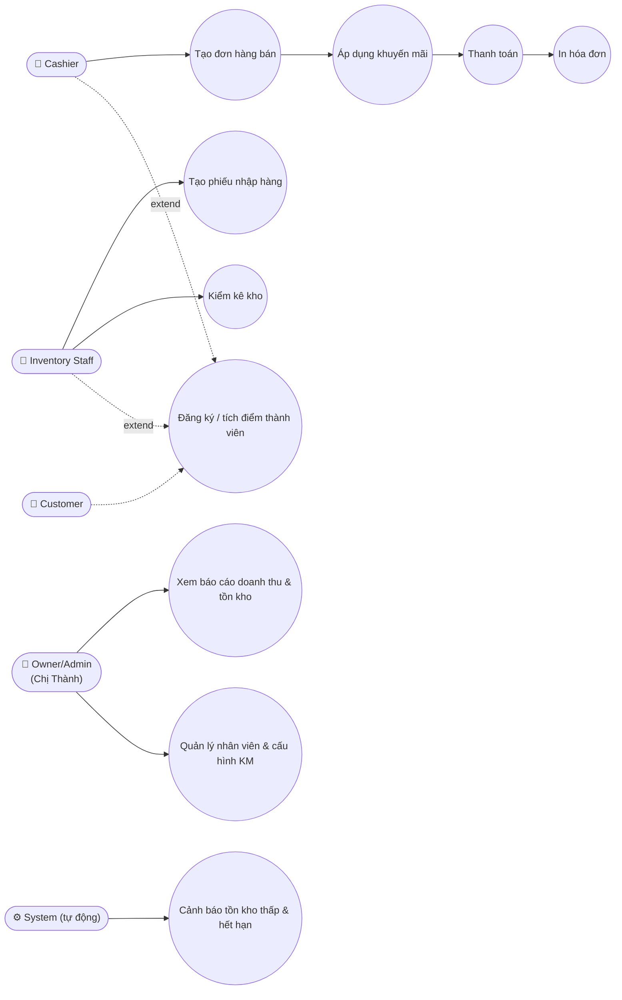
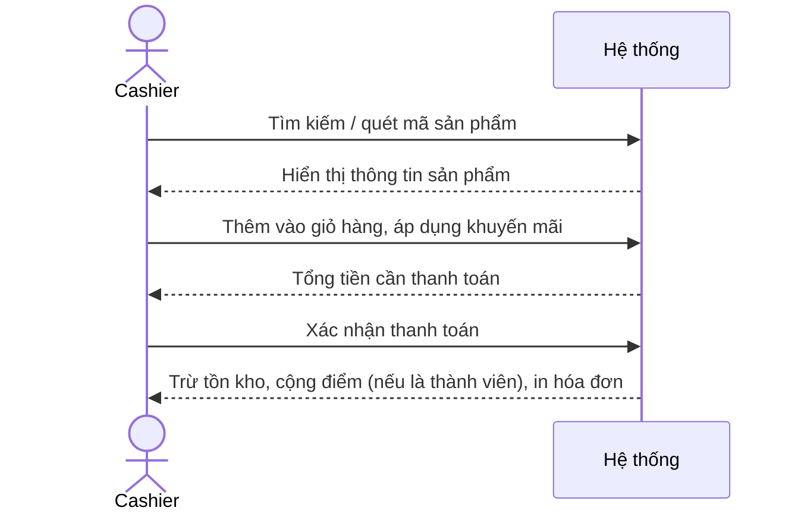

# 4. Use Case Diagram & Đặc tả Use Case

## 4.1. Danh sách Actor

- **Owner/Admin (Chị Thành)** — quản lý toàn bộ hệ thống, xem báo cáo.
- **Cashier** — nhân viên bán hàng, thao tác tại quầy.
- **Inventory Staff** — nhân viên kho, quản lý nhập hàng, tồn kho.
- **Customer** — khách hàng, được ghi nhận thông tin và tích điểm (không thao tác trực tiếp lên hệ thống).

## 4.2. Sơ đồ quan hệ Actor – Use Case

> Mermaid không hỗ trợ chuẩn UML Use Case Diagram, nên sơ đồ dưới đây dùng dạng flowchart để
> mô tả quan hệ Actor – Use Case. Khi làm portfolio, nên vẽ lại bằng draw.io/Lucidchart theo
> đúng chuẩn UML (hình que + oval) để trực quan và chuyên nghiệp hơn.

## 4.3. Đặc tả chi tiết Use Case

### UC-01: Tạo đơn hàng bán

| Thuộc tính | Nội dung |
|---|---|
| **Actor chính** | Cashier |
| **Mô tả** | Nhân viên bán hàng tạo đơn hàng cho khách hàng mua sắm tại quầy, bao gồm chọn sản phẩm, áp dụng khuyến mãi (nếu có) và thanh toán |
| **Pre-condition** | Nhân viên đã đăng nhập với vai trò Cashier; sản phẩm tồn tại trong hệ thống và còn hàng |
| **Main Flow** | 1. Cashier tìm kiếm sản phẩm theo tên hoặc quét mã vạch 2. Hệ thống hiển thị thông tin sản phẩm và thêm vào giỏ hàng 3. Cashier điều chỉnh số lượng nếu cần 4. Cashier áp dụng mã giảm giá/khuyến mãi (nếu có) 5. Hệ thống tính tổng tiền cần thanh toán 6. Cashier chọn hình thức thanh toán và xác nhận 7. Hệ thống trừ tồn kho, ghi nhận giao dịch và in hóa đơn |
| **Alternative Flow** | 3a. Nếu sản phẩm không đủ tồn kho, hệ thống cảnh báo và không cho phép vượt số lượng tồn 6a. Nếu khách hàng là thành viên, hệ thống tự động cộng điểm sau khi thanh toán |
| **Post-condition** | Đơn hàng được lưu; tồn kho được cập nhật; hóa đơn được xuất |

### UC-02: Tạo phiếu nhập hàng

| Thuộc tính | Nội dung |
|---|---|
| **Actor chính** | Inventory Staff |
| **Mô tả** | Nhân viên kho tạo phiếu nhập hàng khi nhận hàng từ nhà cung cấp, hệ thống tự động cập nhật tồn kho sau khi xác nhận |
| **Pre-condition** | Nhân viên đã đăng nhập với vai trò Inventory Staff; nhà cung cấp đã tồn tại trong hệ thống |
| **Main Flow** | 1. Inventory Staff chọn nhà cung cấp 2. Thêm danh sách sản phẩm nhập kèm số lượng, đơn giá nhập, hạn sử dụng 3. Hệ thống tính tổng giá trị phiếu nhập 4. Inventory Staff xác nhận phiếu nhập 5. Hệ thống cộng số lượng tương ứng vào tồn kho |
| **Alternative Flow** | 2a. Nếu sản phẩm chưa tồn tại, Inventory Staff có thể tạo mới sản phẩm ngay trong luồng nhập hàng 4a. Inventory Staff có thể lưu phiếu nháp để chỉnh sửa sau |
| **Post-condition** | Phiếu nhập được lưu; tồn kho các sản phẩm liên quan được cập nhật tăng |

### UC-03: Cảnh báo tồn kho thấp & hạn sử dụng

| Thuộc tính | Nội dung |
|---|---|
| **Actor chính** | Hệ thống (tự động); Owner/Inventory Staff (nhận thông báo) |
| **Mô tả** | Hệ thống tự động kiểm tra và cảnh báo khi tồn kho sản phẩm xuống dưới ngưỡng tối thiểu hoặc khi sản phẩm sắp hết hạn sử dụng |
| **Pre-condition** | Ngưỡng tồn kho tối thiểu và số ngày cảnh báo hạn sử dụng đã được cấu hình cho từng sản phẩm/danh mục |
| **Main Flow** | 1. Hệ thống định kỳ (hoặc theo thời gian thực khi có giao dịch) kiểm tra tồn kho và hạn sử dụng 2. Nếu tồn kho ≤ ngưỡng tối thiểu, tạo cảnh báo "Sắp hết hàng" 3. Nếu hạn sử dụng còn ≤ số ngày cấu hình, tạo cảnh báo "Sắp hết hạn" 4. Owner/Inventory Staff xem danh sách cảnh báo trên Dashboard |
| **Alternative Flow** | 3a. Sản phẩm không có hạn sử dụng (VD: đồ gia dụng) sẽ được bỏ qua bước kiểm tra hạn sử dụng |
| **Post-condition** | Danh sách cảnh báo được cập nhật và hiển thị cho người dùng liên quan |

### UC-04: Xem báo cáo doanh thu

| Thuộc tính | Nội dung |
|---|---|
| **Actor chính** | Owner/Admin (Chị Thành) |
| **Mô tả** | Chị Thành xem báo cáo tổng hợp doanh thu theo khoảng thời gian tùy chọn để phục vụ ra quyết định kinh doanh |
| **Pre-condition** | Owner đã đăng nhập hệ thống; có ít nhất một giao dịch bán hàng đã phát sinh |
| **Main Flow** | 1. Owner chọn khoảng thời gian cần xem báo cáo 2. Hệ thống tổng hợp dữ liệu giao dịch 3. Hệ thống hiển thị biểu đồ doanh thu, tổng số đơn hàng, giá trị đơn trung bình 4. Owner có thể lọc thêm theo nhân viên hoặc danh mục sản phẩm |
| **Alternative Flow** | 1a. Nếu không có dữ liệu trong khoảng thời gian chọn, hệ thống hiển thị "Không có dữ liệu" |
| **Post-condition** | Báo cáo được hiển thị; Owner có thể xuất báo cáo ra file (Excel/PDF) |

### UC-05: Đăng ký & tích điểm thành viên

| Thuộc tính | Nội dung |
|---|---|
| **Actor chính** | Cashier (thao tác hộ); Customer |
| **Mô tả** | Khách hàng được đăng ký làm thành viên và tích lũy điểm thưởng dựa trên giá trị mua hàng |
| **Pre-condition** | Khách hàng đồng ý cung cấp thông tin cá nhân (tên, số điện thoại) để đăng ký thành viên |
| **Main Flow** | 1. Cashier chọn chức năng "Đăng ký thành viên mới" 2. Nhập thông tin khách hàng: tên, số điện thoại 3. Hệ thống tạo mã thành viên và lưu thông tin 4. Trong các lần mua hàng sau, hệ thống tự động cộng điểm theo tỷ lệ cấu hình (VD: 10.000đ = 1 điểm) 5. Khách hàng có thể dùng điểm tích lũy để quy đổi thành giảm giá |
| **Alternative Flow** | 2a. Nếu số điện thoại đã tồn tại, hệ thống thông báo khách hàng đã là thành viên |
| **Post-condition** | Thông tin khách hàng và điểm tích lũy được lưu trữ, có thể tra cứu ở các lần mua hàng sau |

---
⬅️ [Trước: FRD](03-frd.md) | ➡️ [Tiếp theo: Business Process Flow](05-process-flow.md)
