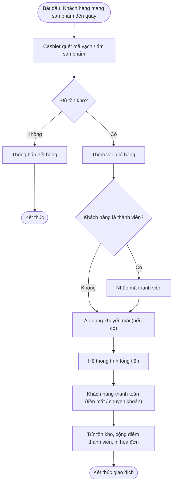
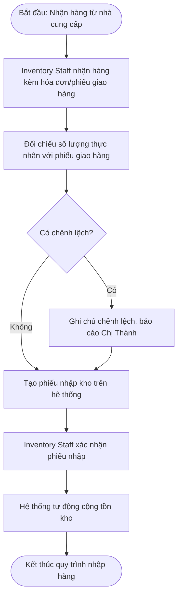
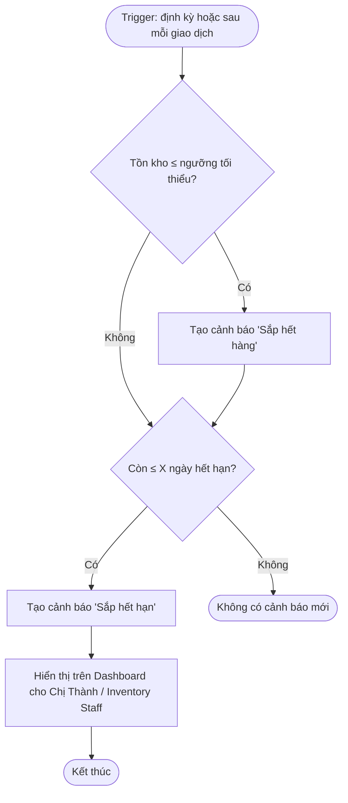

# 5. Business Process Flow

## 5.1. Quy trình Bán hàng (Sales Process)

> **Ghi chú trình bày:** khi làm portfolio, nên vẽ lại quy trình này theo đúng chuẩn ký hiệu
> BPMN (Start Event tròn, Task hình chữ nhật bo góc, Gateway hình thoi, End Event tròn viền đậm)
> bằng draw.io hoặc Lucidchart để đúng chuẩn nghiệp vụ hơn.

## 5.2. Quy trình Nhập hàng (Procurement Process)

## 5.3. Quy trình Cảnh báo tự động (Alert Process)

---
⬅️ [Trước: Use Cases](04-use-cases.md) | ➡️ [Tiếp theo: ERD](06-erd.md)
