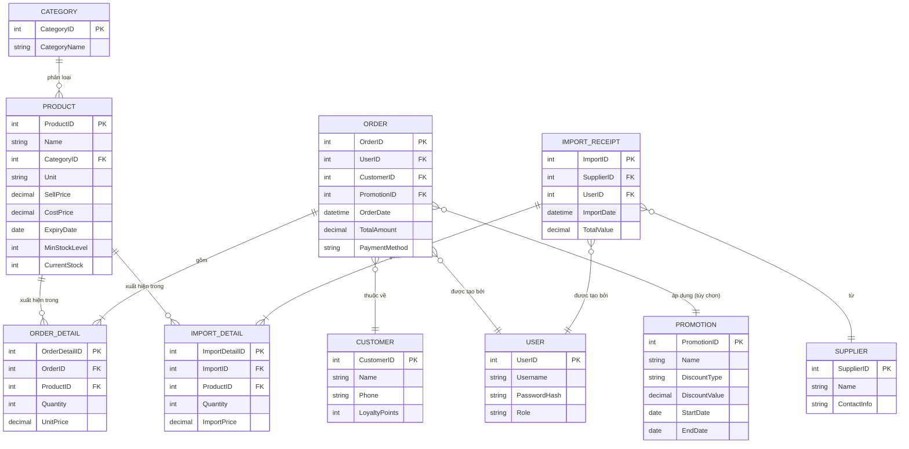

# 6. Entity Relationship Diagram (ERD)

## 6.1. Sơ đồ quan hệ thực thể

## 6.2. Mô tả thực thể

| Thực thể | Thuộc tính chính | Quan hệ |
|---|---|---|
| **Product** | ProductID, Name, Category, Unit, SellPrice, CostPrice, ExpiryDate, MinStockLevel, CurrentStock | 1 Product thuộc 1 Category; xuất hiện trong nhiều OrderDetail và ImportDetail |
| **Category** | CategoryID, CategoryName | 1 Category có nhiều Product |
| **Order** | OrderID, UserID, CustomerID, OrderDate, TotalAmount, PaymentMethod | Thuộc 1 User (Cashier), có thể thuộc 1 Customer; có nhiều OrderDetail |
| **OrderDetail** | OrderDetailID, OrderID, ProductID, Quantity, UnitPrice | Thuộc 1 Order và 1 Product |
| **ImportReceipt** | ImportID, SupplierID, UserID, ImportDate, TotalValue | Thuộc 1 Supplier và 1 User (Inventory Staff); có nhiều ImportDetail |
| **ImportDetail** | ImportDetailID, ImportID, ProductID, Quantity, ImportPrice | Thuộc 1 ImportReceipt và 1 Product |
| **Supplier** | SupplierID, Name, ContactInfo | 1 Supplier có nhiều ImportReceipt |
| **Customer** | CustomerID, Name, Phone, LoyaltyPoints | 1 Customer có nhiều Order |
| **User** | UserID, Username, PasswordHash, Role (Owner/Cashier/InventoryStaff) | 1 User có nhiều Order hoặc ImportReceipt tùy vai trò |
| **Promotion** | PromotionID, Name, DiscountType, DiscountValue, StartDate, EndDate | Có thể áp dụng cho nhiều Order |

---
⬅️ [Trước: Business Process Flow](05-process-flow.md) | ➡️ [Tiếp theo: Wireframes](07-wireframes.md)
