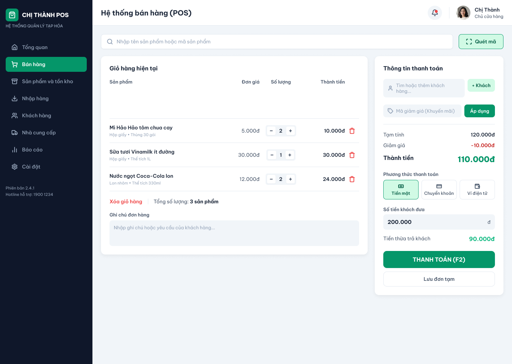
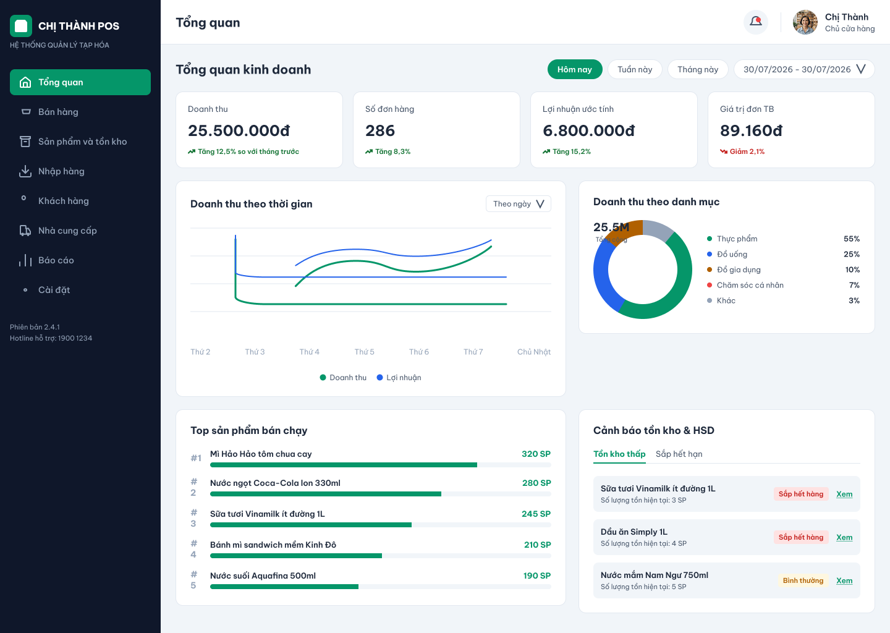

# 🛒 GSMS — Grocery Store Management System
### Bộ tài liệu phân tích nghiệp vụ cho hệ thống quản lý bán hàng
**Cửa hàng Tạp hóa Chị Thành** *(Ms. Thanh's Grocery Store)*

## 👋 Giới thiệu

Đây là bộ tài liệu phân tích nghiệp vụ được xây dựng dưới dạng một **dự án cá nhân**, mô phỏng quy trình làm việc của Business Analyst trong một dự án phần mềm — từ phân tích bối cảnh kinh doanh, xác định vấn đề, phân tích yêu cầu đến đặc tả chức năng, xây dựng use case, mô hình hóa quy trình và thiết kế dữ liệu.

Dự án lấy bối cảnh giả định là xây dựng hệ thống quản lý bán hàng tích hợp POS và quản lý kho cho **Tạp hóa chị Thành** — một cửa hàng quy mô nhỏ đang vận hành chủ yếu bằng sổ sách và Excel, đồng thời có nhu cầu số hóa các quy trình cốt lõi để quản lý hiệu quả hơn.

## 🧩 Bài toán kinh doanh

Chị Thành hiện quản lý cửa hàng hoàn toàn thủ công, dẫn đến nhiều điểm nghẽn:

| Vấn đề | Hệ quả |
|---|---|
| Kiểm đếm tồn kho bằng tay | Sai số, mất thời gian, khó kiểm soát theo thời gian thực |
| Không có cảnh báo hết hàng / hết hạn | Gián đoạn kinh doanh, thất thoát hàng hóa |
| Tính doanh thu thủ công cuối ngày | Mất thời gian, dễ sai lệch |
| Không có dữ liệu khách hàng thân thiết | Khó giữ chân khách, không tối ưu được doanh thu |

→ Từ đó, dự án đề xuất một hệ thống giúp **số hóa các quy trình cốt lõi gồm bán hàng, nhập hàng và quản lý tồn kho**, đồng thời cung cấp báo cáo hỗ trợ chủ cửa hàng ra quyết định dựa trên dữ liệu.
## 📚 Tài liệu dự án

| # | Tài liệu | Nội dung chính |
|---|---|---|
| 01 | [Tổng quan dự án](docs/01-project-overview.md) | Bối cảnh, mục tiêu, phạm vi, stakeholder |
| 02 | [BRD — Business Requirement Document](docs/02-brd.md) | Yêu cầu nghiệp vụ & tiêu chí thành công |
| 03 | [FRD — Functional Requirement Document](docs/03-frd.md) | Yêu cầu chức năng & phi chức năng chi tiết |
| 04 | [Use Case Specifications](docs/04-use-cases.md) | Actor, sơ đồ Use Case, đặc tả chi tiết từng use case |
| 05 | [Business Process Flow](docs/05-process-flow.md) | Lưu đồ quy trình Bán hàng / Nhập hàng / Cảnh báo (Mermaid) |
| 06 | [ERD — Entity Relationship Diagram](docs/06-erd.md) | Mô hình dữ liệu sơ bộ |
| 07 | [Wireframes & Mockup](docs/07-wireframes.md) | Giao diện các màn hình chính (Figma) |

## 🖼️ Xem trước giao diện

 
<i>Màn hình Bán hàng POS và Dashboard báo cáo — xem đầy đủ tại <a href="docs/07-wireframes.md">07-wireframes.md</a></i>

## 🎯 Phạm vi dự án

**✅ Trong phạm vi**
- Bán hàng tại quầy (POS): tạo đơn, khuyến mãi, thanh toán, in hóa đơn
- Quản lý sản phẩm & tồn kho, cảnh báo hết hàng / hết hạn
- Quản lý nhập hàng & nhà cung cấp
- Quản lý khách hàng thân thiết (tích điểm)
- Báo cáo doanh thu, tồn kho, sản phẩm bán chạy
- Phân quyền theo vai trò người dùng

**⛔ Ngoài phạm vi (giai đoạn 1)**
- Bán hàng đa kênh / website thương mại điện tử
- Tích hợp cổng thanh toán bên thứ ba
- Quản lý chuỗi cung ứng nhiều chi nhánh

## 👥 Stakeholders

| Vai trò | Mô tả |
|---|---|
| **Chị Thành** (Owner/Admin) | Chủ cửa hàng, ra quyết định kinh doanh |
| **Cashier** | Nhân viên bán hàng tại quầy |
| **Inventory Staff** | Nhân viên quản lý kho, nhập hàng |
| **Customer** | Khách hàng mua sắm, thành viên tích điểm |
| **Supplier** | Nhà cung cấp hàng hóa |

## 🧠 Năng lực thể hiện qua dự án

- Phân tích vấn đề và mục tiêu kinh doanh
- Xác định stakeholder và phạm vi dự án
- Xây dựng BRD và FRD
- Viết Use Case Specification
- Mô hình hóa quy trình nghiệp vụ
- Xây dựng Business Rules
- Thiết kế mô hình dữ liệu ERD
- Thiết kế wireframe và UI mockup
- Trình bày tài liệu dự án trên GitHub
- 
## ✍️ Về tác giả

**Võ Huỳnh Thủy Tiên**  
Sinh viên ngành Khoa học dữ liệu  
Định hướng: Business Analysis và Data Analysis  
Đang tìm kiếm cơ hội thực tập Business Analyst  

📫 **Email:** vohuynhthuytien1769@gmail.com

<i>Đây là dự án học tập / portfolio cá nhân, không phải sản phẩm thương mại thực tế.</i>

